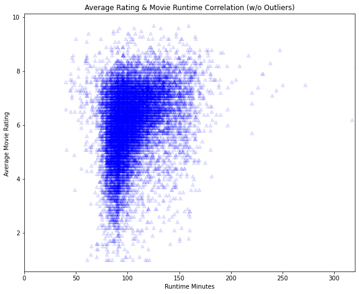
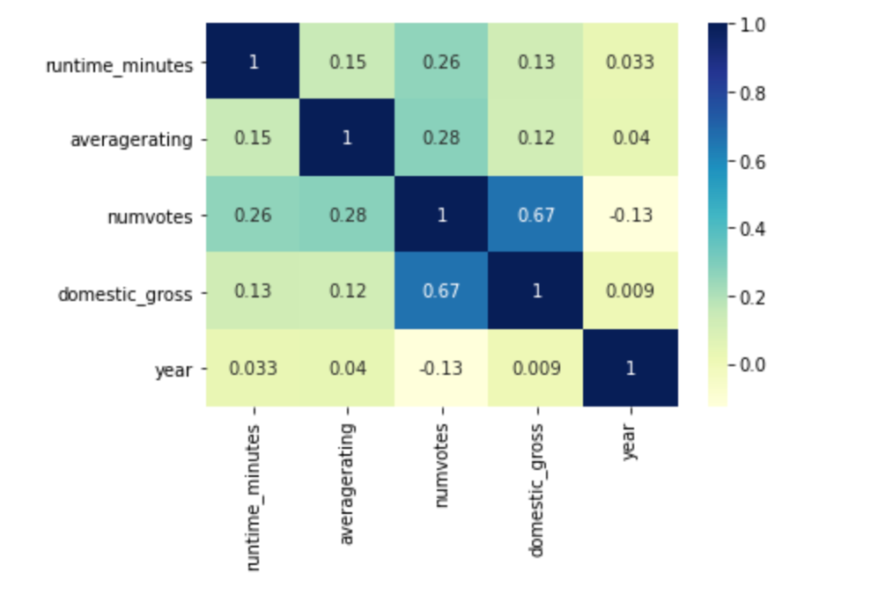

# Microsoft Movie Studio Analysis


**Author**: Ashley Eakland


## Overview

I have been tasked with gathering insights for Microsoft as they venture into the movie-making business. My goal is to identify areas and variables in which Microsoft can focus their attention to ensure profitability as they make their leap into this venture. I will analyze the data provided to identify what attributes the top performing films have in common using exploratory data analysis, statistics, and visualizations. Through my analysis, I have been able to identify correlations between film ratings and domestic gross, movie runtimes, and genres. Based on these findings, I have made recommendations to stick within a specific runtime range, aim for highest number of ratings possible, and identified which genres are most likely to be profitable.  

## Business Problem

Microsoft is considering opening a movie studio, but does not have a knowledge base of the film industry, and seeks insight to launch a successful film studio. To assist with this problem, I am analyzing film statistics from the past 11 years to determine which genres of films performed well, and if there are particular reasons why those genres perform well.
***
* Which movie genres performed the best in terms of gross domestic profit?
* What correlations between the top genres and other variables exist (i.e. runtime minutes, average ratings, etc)?

By finding the answers to these questions, I believe I can provide valuable insight to Microsoft to identify the focus areas to best allocate funds and ensure a successful launch.
***

## Data

## Data Understanding

For this analysis, I am utilizing provided datasets from IMDB and Box Office Mojo so that I may analyze to provide insight to Microsoft as they navigate entry into the movie industry. These datasets represent film statistics and performance both with international and domestic releases, spanning many genres and runtime lengths going back to 2010 and all the way up to films yet to be released. Variables include movie titles, ratings, runtimes, genres, and gross profit. Target variable is going to be profit as the main goal behind any business venture is going to be profitability. 

For the purpose of this analysis, I will eliminate the movies not yet released as they will not serve in the analysis of profitability. I will look at correlations between ratings, runtimes, genres, and gross profit to see where funds are likely to be best allocated.


## Methods

Upon a cursory review of the data, we see that there are missing values in the genre, runtime, and original_title columns in the Titles dataframe. The gross profit dataframe is also missing values in both the domestic and foreign gross profit columns. To first identify what columns and values can be dropped, I will need to combine my dataframes for analysis with profit, as profit is my target variable. The ratings dataframe is complete.

***

* I did discover many duplicate values that were throughout the combined dataframe. I identified the duplicates, found the first instance in the set (identified release year and profit) and dropped the duplicated titles. I dropped the "original_title" column from the dataset for cleanliness as I didn't need that column for my analysis, considering that we were only dealing with movies as they were released, not considering pre-release status.
* For the null values in the dataset, runtime minutes was missing about 10% of it's total values. Through analysis, I determined that the median would be the suitable option to fill the null values. Additionally, domestic gross was missing a small percent (less than 1%) of it's values. By taking a closer look at those 22 titles showing null values, I determined that those did have foreign_gross values, so I decided to break those out into the foreign film dataframe to be analyzed with the foreign films. Lastly, there were missing values in the genres column that I needed to handle. Given the size of the dataset, overall percentage of missing was just over 1%. Furthermore, I would be unable to fill these values with a "common" genre as every film is so different and could fit into a multitude of genres. For these reasons, I opted to drop those values.
* I did limit the number of values in this sample on my initial combined and sorted dataframe of rated titles to 15003 in order to collect a meaningful value of reviewed films. I sorted my values by the number of votes, and then by the average rating to get films that had at least 429 ratings. 429 ratings may still be low in terms of votes by viewers, but I wanted a larger sample as a starting point for analysis. I did further narrow this scope as my analysis progressed to the top 1000 films when analyzing profit.

### Data Modeling

As I completed my cleaning steps of the dataframes, I utilized the visualizations below to see the correlations that exist between the variables in the datasets. 
* Using the top grossing films, I was able to see which genres performed the best at the box office in terms of gross domestic profit when compared to just the top 1000 films in this set. To try and corroborate this, I analyzed the genres from the top ranking films (by average rating) by also graphing the top 1000 ranked films by their genres, and we do see the same four genres rank out consistently at the top. Going a step further, because the correlation between domestic gross profit and the number of ratings is stronger, I also wanted to visualize which genres are most ranked by filmgoers. Again, we see Drama, Action, Adventure and Comedy rounding out the top 4. Additionally, I wanted to analyze correlations between runtimes and ratings, and ratings and profits, as both may seem to have weight on box office performance.
* Since many of my questions involve two variables, models used were primarily scatter plots and bar graphs, analyzed by the relationship between the two graphed variables and based upon the cleaned data prepared for modeling. I did utilize heatmaps as well, which are a concise and different way to see the correlations shown in the scatter plots. 
* I continuously scoured my data to ensure that it was clean and complete, watching for potential correlations or questions to jump out as I progressed through. I made numerous dataframe copies so that I could run various trials without risk of ruining existing tables or graphs.
* Why are these choices appropriate given the data and the business problem? As with any business, the main goal is profitability. My goal was to identify at least one profit driven recommendation with visualization and cleaned data and processing steps to back it up. 
***


## Results

***

### Genre

* Top grossing films are in the Adventure, Action, Comedy, and Drama genres respectively, among others listed. Genres were difficult to analyze in this dataset due to the structure, and I would like additional time to reassess genre specific data for more specific recommendations pertinent to genre.


### Movie Length

* Positive correlations associated with both average movie rating and movie runtime as well as the number of votes and movie run time. Number of ratings are a critical variable in evaulating the average rating as with a low number of ratings, the average rating data will be skewed. 




### Rating Importance

* Higher number of ratings tend to correlate with higher profit. More people seeing and rating the movie would equate to more profitability. Intuitively, we may think that a higher average rating would equate to higher profitability, and to some degree, that may be true. But the correlation between average rating ang gross profit (domestically) is much weaker than seen with number of votes, respectively, in this dataset.




* This data could be generalized beyond the data possessed. I believe that while the results I have extrapolated from my analysis are broad in terms of recommendations, they are supported and could be replicated with similar or additional data. I would like to see a dataset with single genres rather than mixed or multiple genres per title as that really has the potential to skew counts and analysis using genre as a variable.

# Conclusions

* Limitations of this analysis would be the lack of insight into genre specificity. I would like to dive deeper into the genres and how they relate with ratings and profitability at a later date if the time allows. As you can see in this notebook, I had started to dive into additional datasets, so additional limitations would be regarding crew analysis and release time analysis. These would be worth exploring should more time be allotted.

### Business Recommendations

 -Focus on the genres of Adventure, Action, Comedy, and Drama. These genres appear on on top grossing, top ranking and most ranked genres. 
 
 -As previously stated, ratings are important. There is a positive correlation between higher number of ratings and higher profit. We want to maximize on the number of ratings we are getting as that has a stronger direct correlation to gross profit than average rating, which would logically make sense. Each "vote" is one ticket at the box office, and we want as many ratings as possible. While average rating is important to some degree, and is positively correlated, it is less critical than number of votes. Go for volume.
 
 -Lastly, I see a positive correlation between run time and average movie rating. With the shown positive correlation between movie runtime and rating, I would recommend sticking around 100, but under 120, minutes of runtime for optimal movie performance. 
 
 
* What are some reasons why your analysis might not fully solve the business problem? 
    My analysis may not fully solve the problem as it does not break down which genre specifically is most profitable or which genre specifically ranks the highest due to the challenges I faced.

* What else could you do in the future to improve this project?
     More depth and detailed analysis into genres and their relationships with other variables would definitely be insightful.
***

## For More Information

Please review my full analysis in [my Jupyter Notebook](./dsc-phase1project-microsoftmoviestudioanalysis-eakland.ipynb) or my [presentation](./DS_Project_Presentation_Eakland.pdf).

For any additional questions, please contact **Ashley Eakland, ashley@eakland.net** Thank you!

## Repository Structure

```
├── README.md                                               <- The top-level README for reviewers of this project
├── dsc-phase1-microsoftmoviestudioanalysis-eakland.ipynb   <- Narrative documentation of analysis in Jupyter notebook
├── DS_Project_Presentation_Eakland.pdf                     <- PDF version of project presentation
├── data                                                    <- Both sourced externally and generated from code
└── images                                                  <- Both sourced externally and generated from code
```

